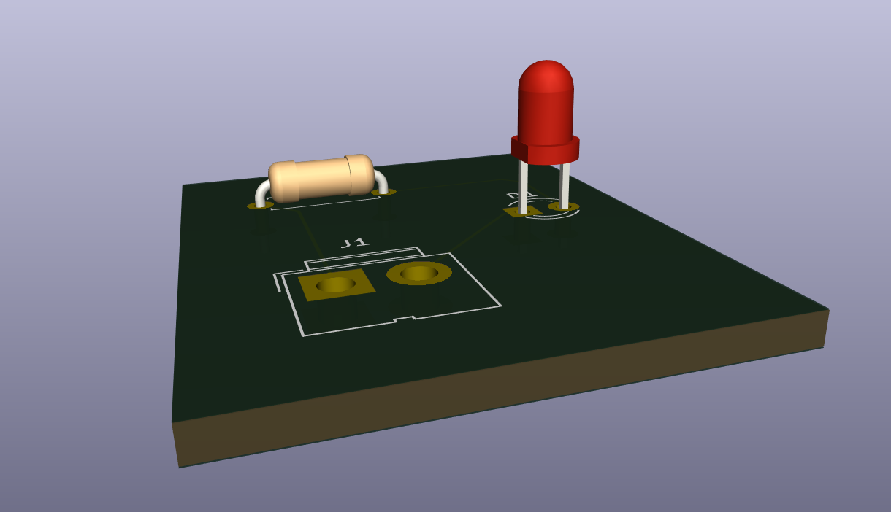
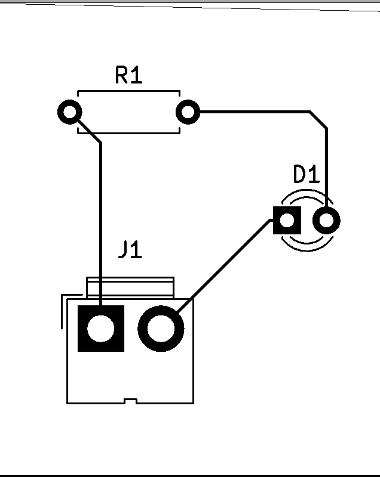

# Simple LED PCB (KiCad 7.0)

Пример простейшей печатной платы в KiCad.  
В этой плате всего три компонента:
- Разъём DC-Jack (двухконтактный)  
- Резистор 330 Ω  
- Светодиод (LED)  

Эта плата служит учебным проектом, чтобы показать ключевые этапы:
1. Создание схемы в Eeschema  
2. Назначение футпринтов (посадочных мест)  
3. Переход к PCBNew и трассировка дорожек  
4. Проверка правил (DRC)  
5. Экспорт Gerber-файлов и просмотр 3D-модели  

---

## Содержание репозитория

```
simple-led-pcb/
├── README.md               ← этот файл
├── LICENSE                 ← файл лицензии (опционально)
├── .gitignore              
│
├── schematic/              
│   ├── Simple_LED.kicad_pro
│   └── Simple_LED.kicad_sch
│
├── pcb/                    
│   └── Simple_LED.kicad_pcb
│
├── gerbers/                
│   ├── Simple_LED-F_Cu.gbr     
│   ├── Simple_LED-F_Silkscreen.gbr  
│   ├── Simple_LED-F_Mask.gbr   
│   ├── Simple_LED-Edge_Cuts.gbr  
│   └── Simple_LED.drl
│
└── images/                 
    ├── pcb_3d_view.png         ← скриншот 3D-модели платы
    └── gerber_preview.png      ← пример просмотра слоёв для печати
```

---

## Как открыть и просмотреть проект

1. **Установите** KiCad версии **7.0** (или выше).  
2. **Откройте схему**:  
   - Запустите KiCad и выберите **File → Open Project…**.  
   - Перейдите в папку `schematic/` и откройте `Simple_LED.kicad_pro`.  
   - Должно открыться окно Eeschema с вашей схемой.

3. **Проверьте футпринты**:  
   - В Eeschema перейдите **Инструменты → Назначить посадочные места…**.  
   - Убедитесь, что для каждого компонента (J1, R1, D1) выбран футпринт.  
   - Закройте окно.

4. **Переключитесь в PCB**:  
   - В Eeschema выберите **Инструменты → Переключиться на редактор плат** (или нажмите **F8**).  
   - В PCBNew нажмите **Обновить плату из схемы** (Confirm → OK).  
   - Появятся все три компонента, соединённые пунктирными линиями (ratsnest).

5. **Расположите компоненты и проложите дорожки**:  
   - Разместите компоненты так, чтобы между ними было достаточно места для трассировки (~2 мм).  
   - Используйте **X (Route Tracks)** и проведите три дорожки:
     1. **J1-1 (V_IN) → R1-1**  
     2. **R1-2 → D1-2 (анод LED)**  
     3. **D1-1 (катод LED) → J1-2 (GND)**  
   - **Нарисуйте контур платы**:
     - Переключитесь на слой **Edge.Cuts** (в выпадающем меню слоёв).
     - Выберите **Разместить → Чертить прямоугольники (Ctrl+Shift+P)** и обведите все компоненты с отступом ~2 мм.

6. **Проверка DRC**:  
   - В PCBNew выберите **Проверка → DRC (Проверить правила проектирования)**.  
   - Нажмите **Запустить DRC**.  
   - Если нарушений нет («0 Errors»), значит всё правильно.

7. **Просмотр 3D-модели**:  
   - В PCBNew выберите **Просмотр → 3D-Показ платы (Alt+3)**.  
   - В новом окне откроется трёхмерное представление вашей платы.  
   - Используйте левую кнопку мыши для вращения, правую – для панорамирования, колёсико – для масштабирования.

---

## Скриншоты

### 1. 3D-вид платы (3D Viewer)


### 2. Пример просмотра Gerber-слоёв (Gerber Preview)


---

## Генерация Gerber-файлов

1. В PCBNew выберите **File → Plot…** (или **Файл → Печать плат**).  
2. В окне «Генерация Gerber» установите галочки:
   - `F.Cu` (верхний медный слой)  
   - `F.Silkscreen` (шелкография сверху)  
   - `F.Mask` (маска флюса сверху)  
   - `Edge.Cuts` (контур платы)  
3. Убедитесь, что **Format** установлен в **Gerber**.  
4. Нажмите **Plot** (или **Печать**).  
5. После отрисовки нажмите **Generate Drill File**:
   - Формат **Excellon**, единицы **mm**.  
   - Оставьте остальные опции по умолчанию и нажмите **OK**.

Все файлы будут сохранены в папке `gerbers/`.

---

## Лицензия

Этот проект распространяется под лицензией [MIT](LICENSE).


